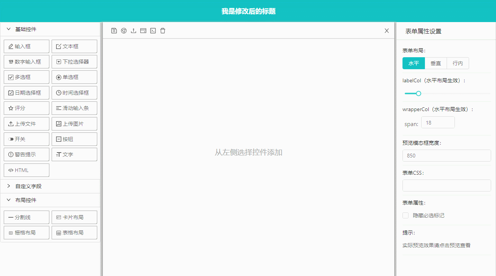
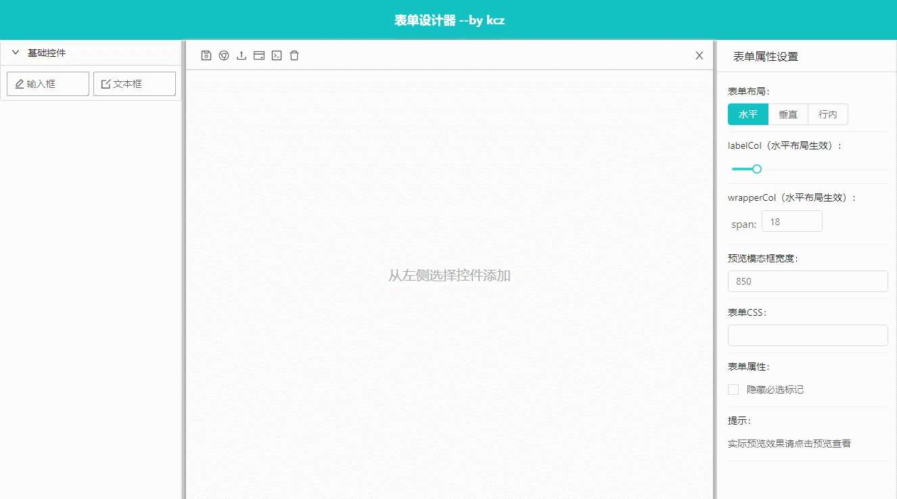
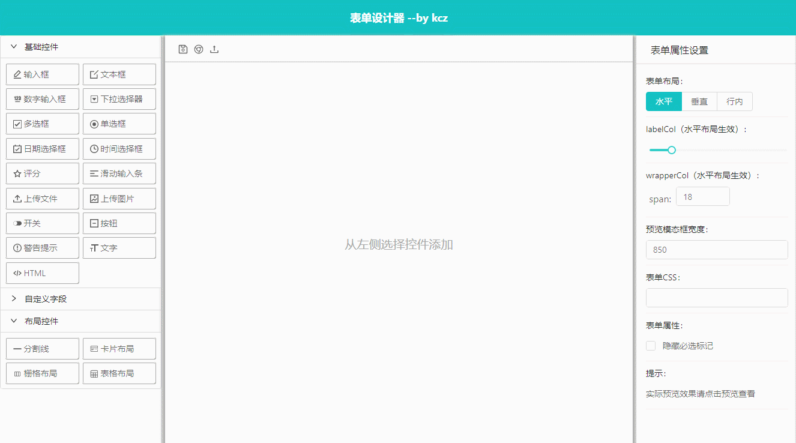
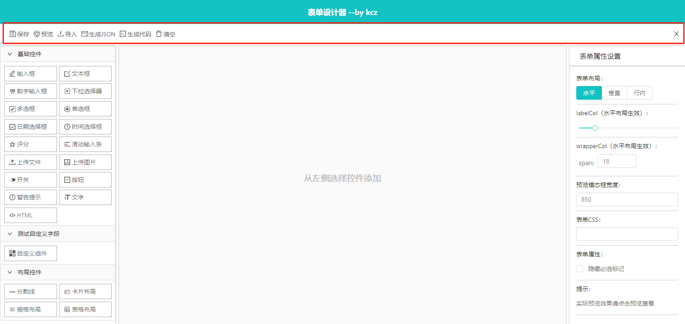
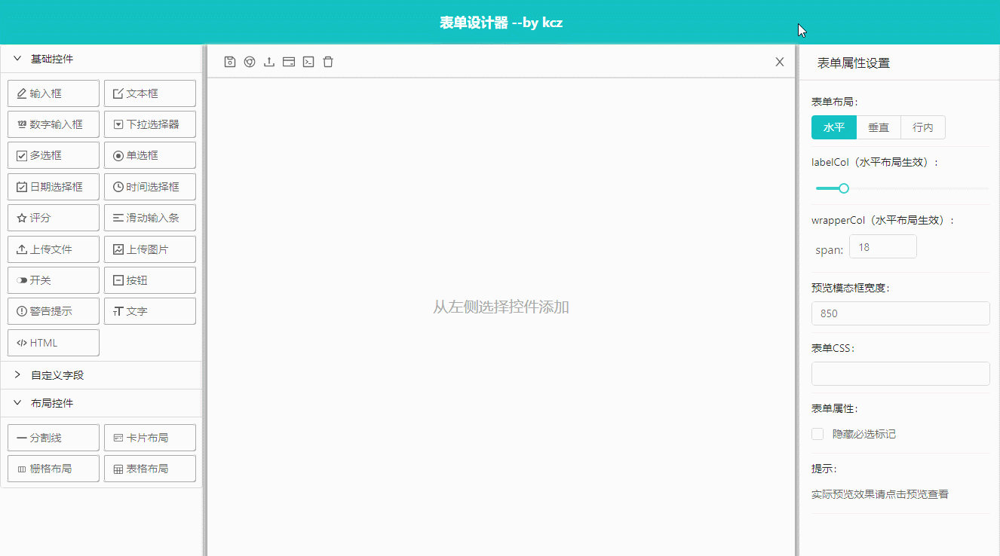
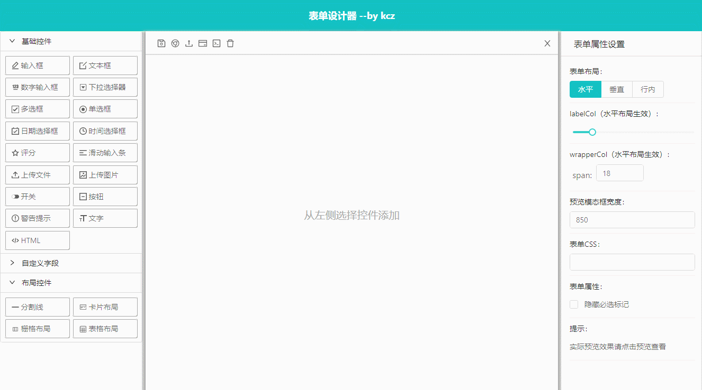

# k-form-design

## 介绍
表单设计器，通过拖拽或点击生成表单[预览地址](http://cdn.kcz66.com/k-form-design.html)

建议将表单设计器组件放到全屏组件或页面使用，使用表格布局时，在设计界面右键可以添加行列和合并单元格

## 基础用法


```  html
<template>
  <div>
    <k-form-design />
  </div>
</template>
```

## 自定义标题



> 使用title属性自定义标题

```  html
<template>
  <div>
    <k-form-design 
      title="我是修改后的标题" 
     />
  </div>
</template>
<script>
```

## 自定义左侧控件列表



> 使用组件fields属性，自定义左侧控件列表

```html
<template>
  <k-form-design showToolbarsText :fields="['input', 'textarea']" />
</template>
```

## 自定义头部操作按钮



> 通过toolbars属性显示隐藏默认按钮

```html
<template>
  <div>
   <k-form-design :toolbars="['save', 'preview', 'importJson']" />
  </div>
</template>
```
## 切换操作按钮位置



> 使用toolbarsTop属性切换操作按钮位置

```html
<template>
  <div>
   <k-form-design toolbarsTop />
  </div>
</template>
```
## 插入自定义按钮


> 使用插槽插入自定义按钮（需要项目引入a-tooltip，a-icon组件）

```html
<template>
  <div>
   <k-form-design >
     <!-- 左侧操作区域插槽 start -->
      <template slot="left-action">
        <a-tooltip title="测试左侧插槽">
          <a>
            <a-icon type="experiment" />
            <!-- <span>测试左侧插槽（showToolbarsText属性为true时需要）</span> -->
          </a>
        </a-tooltip>
      </template>
     <!-- 左侧操作区域插槽 end -->
     <!-- 右侧操作区域插槽 start -->
      <template slot="right-action">
        <a-tooltip title="测试右侧插槽">
          <a>
            <a-icon type="experiment" />
            <!-- <span>测试右侧插槽（showToolbarsText属性为true时需要）</span> -->
          </a>
        </a-tooltip>
      </template>
     <!-- 右侧操作区域插槽 end -->
    </k-form-design>
  </div>
</template>
```

## 表单设计器save事件，点击保存时触发



> 使用组件save事件保存json

```  html
<template>
  <div>
    <k-form-design @save="handleSave" />
  </div>
</template>
<script>
export default {
  methods: {
    handleSave(values) {
      alert("触发保存方法");
      console.log(values);
    }
  }
};
</script>
```
## 导入json数据



> 使用组件handleSetData函数导入json数据

```  html
<template>
  <k-form-design ref='kfd' />
</template>
<script>
export default {
  data () {
    return {
      jsonData: {
        list: [
          {
            type: 'textarea',
            label: '文本框',
            icon: 'icon-edit',
            options: {
              width: '100%',
              minRows: 4,
              maxRows: 6,
              defaultValue: '',
              disabled: false,
              placeholder: '请输入'
            },
            model: 'textarea_1584772782841',
            key: 'textarea_1584772782841',
            rules: [
              {
                required: false,
                message: '必填项'
              }
            ]
          }
        ],
        config: {
          layout: 'horizontal',
          labelCol: {
            span: 4
          },
          wrapperCol: {
            span: 18
          },
          hideRequiredMark: false,
          customStyle: ''
        }
      }
    }
  },
  methods: {
    importData () {
      this.$refs.kfd.handleSetData(this.jsonData)
    }
  },
  mounted () {
    this.importData()
  }
}
</script>
```


## API
  <table>
    <thead>
      <tr>
        <th>参数</th>
        <th>说明</th>
        <th>类型</th>
        <th>默认值</th>
        <th>版本</th>
      </tr>
    </thead>
    <tbody>
      <tr>
        <td>title</td>
        <td>表单设计器标题</td>
        <td>string</td>
        <td>"表单设计器 --by kcz"</td>
        <td></td>
      </tr>
      <tr>
        <td>showHead</td>
        <td>是否显示head部分</td>
        <td>boolean</td>
        <td>true</td>
        <td></td>
      </tr>
      <tr>
        <td>toolbars</td>
        <td>显示对应的操作按钮</td>
        <td>array</td>
        <td>[
        'save',
        'preview',
        'importJson',
        'exportJson',
        'exportCode',
        'reset',
        'close'
      ]</td>
        <td>3.0.7</td>
      </tr>
      <tr>
        <td>toolbarsTop</td>
        <td>切换操作按钮位置</td>
        <td>boolean</td>
        <td>false</td>
        <td>3.1.6</td>
      </tr>
       <tr>
        <td>showToolbarsText</td>
        <td>是否显示操作按钮文本</td>
        <td>boolean</td>
        <td>false</td>
        <td>3.1.1</td>
      </tr>
       <tr>
        <td>fields</td>
        <td>自定义左侧控件列表</td>
        <td>array</td>
        <td style="max-width:280px;">[
         "input",
        "textarea",
        "number",
        "select",
        "checkbox",
        "radio",
        "date",
        "time",
        "rate",
        "slider",
        "uploadFile",
        "uploadImg",
        "switch",
        "button",
        "alert",
        "text",
        "html",
        "divider",
        "card",
        "grid",
        "table"
      ]</td>
       <td>3.0.7</td>
      </tr>
        <tr>
        <td>hideModel</td>
        <td>隐藏数据字段</td>
        <td>boolean</td>
        <td>false</td>
        <td>3.5.1</td>
      </tr>
    </tbody>
  </table>


## Slots 

3.0.7及更高版本

<table>
    <thead>
      <tr>
        <th>label</th>
        <th>说明</th>
      </tr>
    </thead>
    <tbody>
     <tr>
     <td>left-action</td>
     <td>表单设计器头部左侧操作区域插槽</td>
     </tr>
         <tr>
     <td>right-action</td>
     <td>表单设计器头部右侧操作区域插槽</td>
     </tr>
     </tbody>
</table>

## 函数
  <table>
    <thead>
      <tr>
        <th>函数名称</th>
        <th>说明</th>
        <th>参数</th>
        <th>回调参数</th>
      </tr>
    </thead>
    <tbody>
     <tr>
        <td>handleSetData</td>
        <td>导入json数据，继续编辑</td>
        <td>json</td>
        <td>boolean</td>
      </tr>
      <tr>
        <td>handleSave</td>
        <td>保存，触发save事件</td>
        <td>-</td>
        <td>void</td>
      </tr>
      <tr>
        <td>handleClose</td>
        <td>关闭，触发close事件</td>
        <td>-</td>
        <td>void</td>
      </tr>
      <tr>
        <td>handleReset</td>
        <td>清除表单</td>
        <td>-</td>
        <td>boolean</td>
      </tr>
    </tbody>
  </table>

  ## 事件
  <table>
    <thead>
      <tr>
        <th>事件名称</th>
        <th colspan="2">说明</th>
        <th>回调参数</th>
      </tr>
    </thead>
    <tbody>
      <tr>
        <td>save</td>
        <td colspan="2">点击保存按钮时回调</td>
        <td>json</td>
      </tr>
      <tr>
        <td>close</td>
        <td colspan="2">点击关闭按钮时回调</td>
        <td>void</td>
      </tr>
    </tbody>
  </table>
