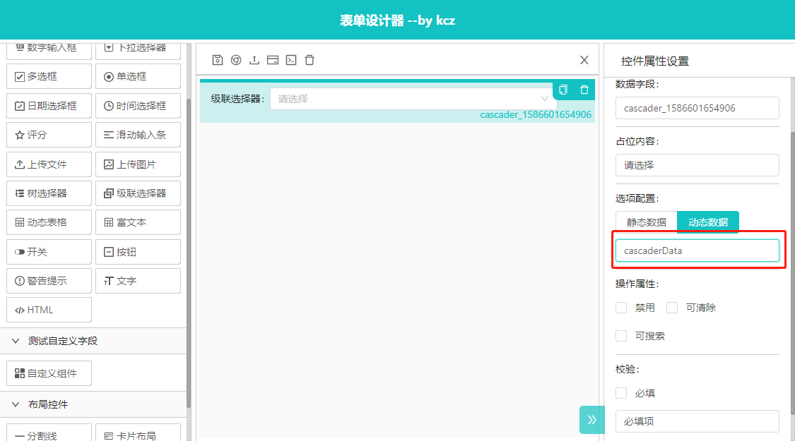
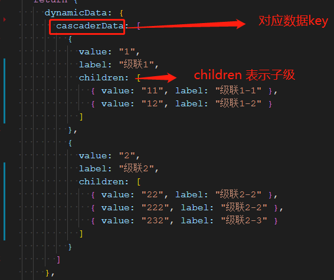
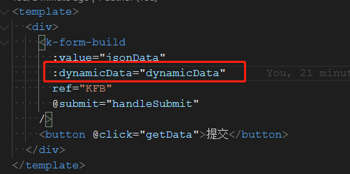

# 联级选择器

## 加载动态数据

配置界面选择动态数据，输入数据key



定义动态数据



最后使用k-form-build组件dynamicData属性传入动态数据



代码示例：

```html
<template>
  <div>
    <k-form-build
      :value="jsonData"
      :dynamicData="dynamicData"
      ref="KFB"
      @submit="handleSubmit"
    />
    <button @click="getData">提交</button>
  </div>
</template>
<script>
export default {
  name: "Demo",
  data() {
    return {
      dynamicData: {
        cascaderData: [
          {
            value: "1",
            label: "级联1",
            children: [
              { value: "11", label: "级联1-1" },
              { value: "12", label: "级联1-2" }
            ]
          },
          {
            value: "2",
            label: "级联2",
            children: [
              { value: "22", label: "级联2-2" },
              { value: "222", label: "级联2-2" },
              { value: "232", label: "级联2-3" }
            ]
          }
        ]
      },
      jsonData: {
        list: [
          {
            type: "cascader",
            label: "级联选择器",
            icon: "icon-guanlian",
            options: {
              disabled: false,
              showSearch: false,
              placeholder: "请选择",
              clearable: false,
              dynamicKey: "cascaderData",
              dynamic: true,
              options: [
                {
                  value: "1",
                  label: "选项1",
                  children: [{ value: "11", label: "选项11" }]
                },
                {
                  value: "2",
                  label: "选项2",
                  children: [{ value: "22", label: "选项22" }]
                }
              ]
            },
            model: "cascader_1586601654906",
            key: "cascader_1586601654906",
            rules: [{ required: false, message: "必填项" }]
          }
        ],
        config: {
          layout: "horizontal",
          labelCol: { span: 4 },
          wrapperCol: { span: 18 },
          hideRequiredMark: false,
          customStyle: ""
        }
      }
    };
  },
  methods: {
    handleSubmit(p) {
      // 通过表单提交按钮触发，获取promise对象
      p()
        .then(res => {
          // 获取数据成功
          alert(JSON.stringify(res));
        })
        .catch(err => {
          console.log(err, "校验失败");
        });
    },
    getData() {
      // 通过函数获取数据
      this.$refs.KFB.getData()
        .then(res => {
          // 获取数据成功
          alert(JSON.stringify(res));
        })
        .catch(err => {
          console.log(err, "校验失败");
        });
    }
  }
};
</script>
```

