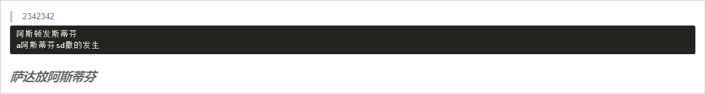

# 富文本

## 富文本样式问题

使用富文本导出数据转成html时缺少样式问题

> 解决：引入snow.css，在需要展示的页面中用如下元素包裹即可

```html
<div class="ql-container ql-snow">
    <div class="ql-editor" v-html="content">
    </div>
</div>
```

> 示例



```html
<template>
  <div class="ql-container ql-snow">
    <div class="ql-editor" v-html="editor_1585549756333"></div>
  </div>
</template>

<script>
import "quill/dist/quill.snow.css";

export default {
  data() {
    return {
      editor_1585549756333:
        '<blockquote>2342342</blockquote><pre class="ql-syntax" spellcheck="false">阿斯顿发斯蒂芬\na阿斯蒂芬sd撒的发生\n</pre><p><br></p><p><strong class="ql-size-large"><em>萨达放阿斯蒂芬</em><span class="ql-cursor"></span></strong></p>'
    };
  }
};
</script>
```

